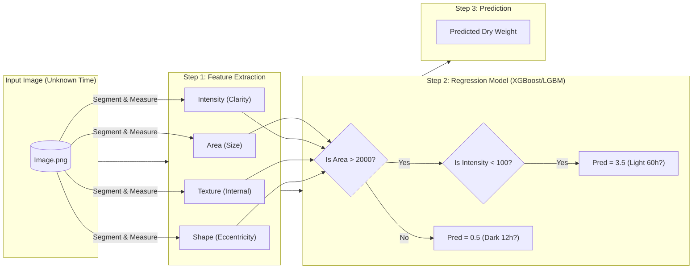
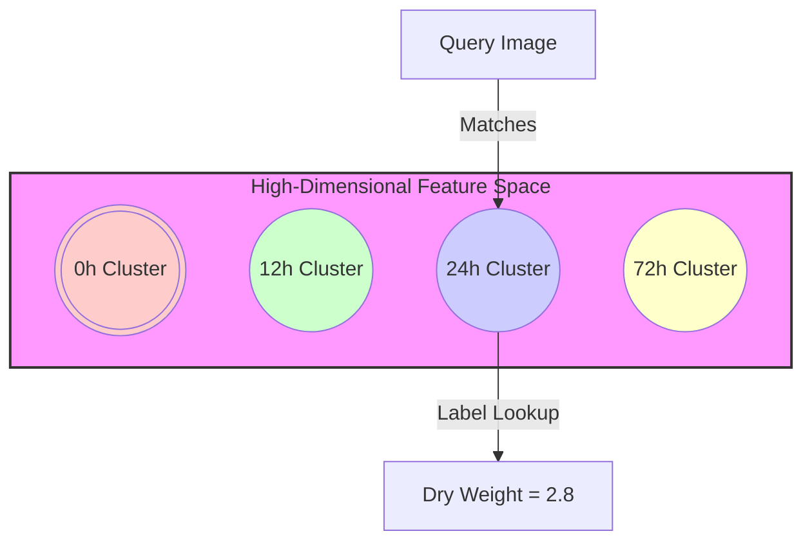

# Why is Static R2 So High? (0.9996)

You are right to be skeptical. An R2 of 0.9996 on a biological dataset usually implies one of two things:
1.  **Data Leakage**: The model saw the answer during training.
2.  **Trivial Task**: The clusters are so distinct that "guessing" is impossible to get wrong.

Here is the exact framework of what is happening inside the **Static Model**:

## 1. The "Static" Framework

## 2. Why R2 is ~1.0 (The "Look-Up Table" Hypothesis)

The model isn't predicting growth *dynamics*; it is recognizing **distinct states**.

Imagine predicting a human's weight.
- **Dynamic Task**: Predict weight change based on what they ate yesterday. (Hard)
- **Static Task**: Predict weight based on a photo of them. (Easy if you have distinct classes)

In your dataset, the timepoints might be morphologically distinct "islands":

**Hypothesis:** 
Your biological samples at 12h, 24h, and 48h look **completely different** (e.g., size doubles, texture changes drastically). The model works like a "classification" scheme:
1.  See big cell -> Must be 48h.
2.  See dark cell -> Must be Dark condition.
3.  If 48h + Dark -> Dry Weight **MUST** be exactly X (because variance within a timepoint is low).

**Conclusion: The "Many-to-One" Mapping**

This explains the contradiction you noticed ("CV is high, but R2 is perfect"):

1.  **Morphology Varies (High CV)**: Within the "48h" group, some cells are big, some small.
2.  **Target is Constant (Zero CV)**: But **EVERY** cell in that group is labeled with the exact same Dry Weight (e.g., 2.183333).
3.  **The Model's Job**: It doesn't need to predict the size difference between two 48h cells. It just needs to figure out **"You are both 48h cells"** and output the constant label **2.183333**.

The model absorbs the morphological noise and maps the entire cluster to a single point.

## 3. How to Refine and Stress-Test the Model

- **Use harder splits that break the "lookup" shortcut**
  - Leave-one-timepoint-out or leave-one-batch-out folds so the model cannot memorize a specific morphology→label mapping.
  - When possible, create domain-shift validation (e.g., unseen lighting or microscope) to check generalization beyond the current clusters.
- **Increase label diversity within clusters**
  - If multiple measurements exist per condition/timepoint, keep them separate instead of averaging so the regression task has intra-group variation.
  - Add continuous covariates (e.g., nutrient level, temperature) to the feature table so the model must predict along gradients, not just classify states.
- **Reduce morphology-only cues**
  - Standardize imaging (exposure, magnification) and include augmentation that perturbs scale/brightness so the model focuses on subtle signals.
  - Consider normalizing features by cell size or per-image statistics to dampen easy clustering signals.
- **Audit and regularize the tree models**
  - Limit tree depth / number of leaves and inspect feature importance; if a single feature dominates, reshape features or add noise tests to ensure robustness.
  - Calibrate predictions on a held-out set to detect overconfident "memorized" leaves.
- **Add temporal/biological structure**
  - If timepoints are known, impose monotonic constraints or sequential models so predictions must follow realistic growth trajectories.
  - For CNN branches, experiment with history stacking or simple 1D temporal models to move from state classification toward dynamics modeling.

These steps turn the task from "identify the state and lookup its mean" into genuine regression on biological signals, giving a more trustworthy R².
